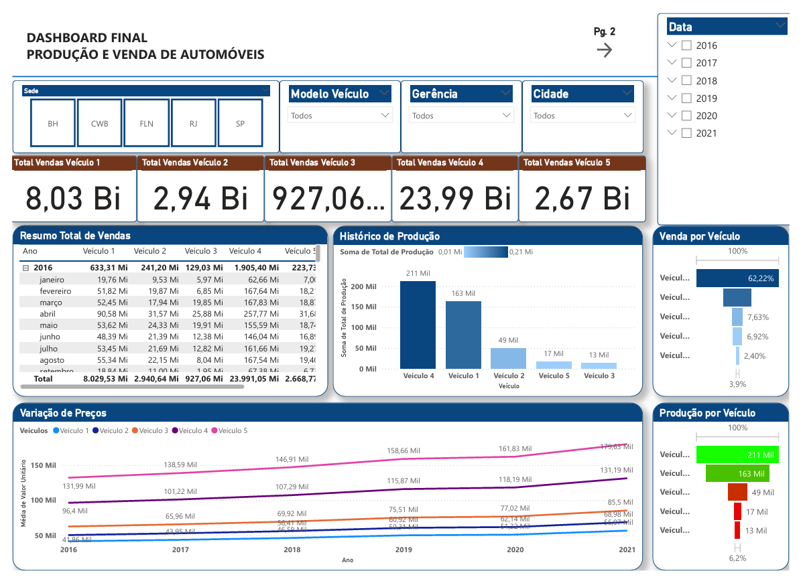

# dashboard_venda_producao_carros
Dashboard Power BI | Análise de Produção e Vendas de Veículos (2016-2021) com insights e filtros.

# Dashboard de Produção e Vendas de Veículos  

Este repositório contém um **dashboard interativo** desenvolvido no **Power BI**, baseado em dados fictícios de produção e vendas de veículos entre 2016 e 2021.  

## Funcionalidades e Insights  
🔹 **Resumo Total de Vendas** > Visão geral do faturamento total.  
🔹 **Vendas por Modelo de Veículo** > Desempenho dos 5 modelos de carros analisados.  
🔹 **Filtros por Sede** > Filtragem por localização: BH, CWB, FLN, RJ e SP.  
🔹 **Histórico de Produção** > Produção total de cada veículo ao longo do tempo.  
🔹 **Variação de Preços** > Tendências e flutuações no preço dos veículos.  
🔹 **Produção por Gerência** > Volume de produção por líderes responsáveis (Fábio, Guilherme, Marcus, Mariana, Natália).  
🔹 **Produção por Estado e Cidade** > Distribuição geográfica da produção.  
🔹 **Vendas por Localização** > Mapa interativo com latitude e longitude das vendas.  
🔹 **Produção Anual** > Evolução da produção de veículos ano a ano.  

## Visão Geral do Dashboard  
  

## Estrutura do Repositório  
 `Dashboard_Arthur_Henrique.pbix` → Arquivo do Power BI com todas as análises.  

## Tecnologias Utilizadas  
- **Power BI** > Construção do dashboard e visualizações.  
- **DAX** > Cálculos e métricas para análise.  
- **Power Query (Excel)** > Transformação e limpeza dos dados antes da importação para o Power BI. 

## Como Usar  
1. Baixe o arquivo **.pbix**.  
2. Abra no **Power BI Desktop**.  
3. Explore os filtros, métricas e insights disponíveis.  

---
**[Meu LinkedIn](www.linkedin.com/in/arthur-henriqueads)** | **Contato: arthurleibhz@gmail.com**
